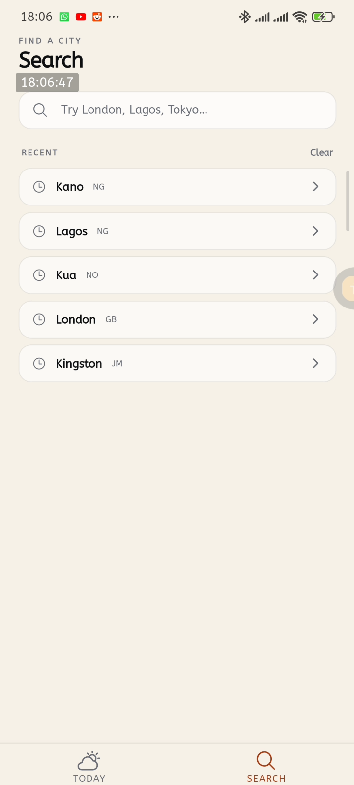
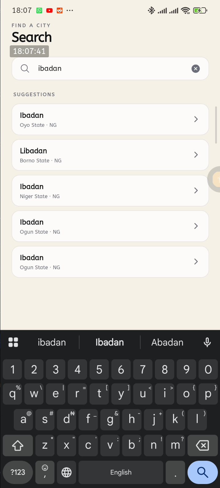
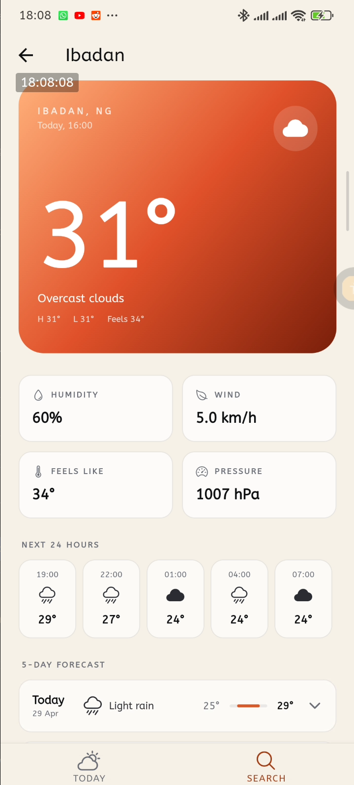
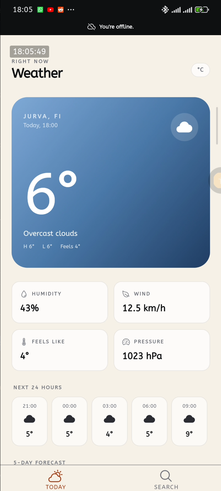

# Weather App, HNG 14 Mobile Stage 4 (Cross-Platform)

A cross-platform weather app built from a single Expo / React Native codebase. Runs on iOS, Android, web browsers, and desktop (Linux + Windows).

- **Live web build:** https://weather-app-hng-14-mobile-stage-3.vercel.app/
- **Desktop builds:** see [Releases](#desktop-builds) below.

Built for HNG 14 Mobile Track Stage 4, which extends the Stage 3 mobile app to web and desktop without forking the codebase.

## Platform support

| Platform | Status | How                                                                            |
| -------- | ------ | ------------------------------------------------------------------------------ |
| iOS      | ✅     | Native Expo dev client (`pnpm ios`)                                            |
| Android  | ✅     | Native Expo dev client (`pnpm android`)                                        |
| Web      | ✅     | `react-native-web`, deployed to Vercel                                         |
| Linux    | ✅     | Electron `.AppImage` (`pnpm desktop:build:linux`)                              |
| Windows  | ✅     | Electron NSIS installer (`pnpm desktop:build:win`, needs Wine on a Linux host) |

## Features

### Mobile (carried over from Stage 3)

- **Location-based weather** — requests foreground permission on Home, then fetches current conditions and forecast for the device's coordinates.
- **City search** — debounced (300 ms) autocomplete backed by OpenWeatherMap's geocoding API. Fires once the query is ≥ 3 characters.
- **Recent searches** — last 10 cities, persisted to AsyncStorage and deduped by `(lat, lon)`.
- **5-day forecast + 24-hour hourly strip** — both derived from a single `/forecast` call to keep request count low.
- **Per-day expand/collapse** — tap a forecast row to reveal that day's hourly slots, with an animated chevron and Reanimated `LinearTransition` for the row resize.
- **Offline-aware data layer** — React Query cache + NetInfo wired into `onlineManager` so requests pause/resume with connectivity.

### Added in Stage 4 (cross-platform)

- **Single codebase, three targets** — mobile, web, and desktop share screens, hooks, types, and the API layer. No forks.
- **Responsive layout** — content stays in a centered max-width column on wide screens; the hourly strip switches from a horizontally-scrolling FlatList on mobile to an evenly-distributed flex row at ≥ 768 px so it fills the available width on tablet/desktop.
- **Platform-adaptive geolocation** — `expo-location` (with permission prompt) on iOS/Android and web; IP-based lookup via `ipapi.co` inside Electron, where Chromium's `navigator.geolocation` requires a Google Maps API key to function.
- **Desktop application menu** — `File / Edit / View / Help` built from `Menu.buildFromTemplate` in `electron/main.js`.
- **Keyboard shortcuts** (desktop, surfaced in the menu):
  - `Ctrl+R` — refresh weather
  - `Ctrl+1` — Today
  - `Ctrl+2` — Search
  - `Ctrl+F` — focus search input
  - `F11` — toggle fullscreen
  - `Ctrl+Shift+I` — toggle DevTools
  - `Ctrl+Q` — quit
- **Resizable window with content adaptation** — `BrowserWindow` minimum 800×600; the responsive layout reflows down to mobile-style at narrow widths.
- **Preload IPC bridge** — `window.electronAPI` (set up in `electron/preload.js` via `contextBridge`) exposes `popupMenu` and `onShortcut` so the renderer can request native context menus and listen for menu-driven actions without breaking context isolation.
- **Offline support everywhere** — `NetInfo` + React Query already worked on mobile; both work in the browser and in Electron (Chromium DOM) with no changes. AsyncStorage automatically falls back to `localStorage` on web/Electron.

## Animations

All animations run on the UI thread on native via `react-native-reanimated` v4 + `react-native-worklets`, and on web/Electron via Reanimated's web build.

- **Forecast list entrance** — each day in the 5-day list fades + slides in with `FadeInDown.delay(i * 80).springify().damping(14)` for a staggered cascade on mount.
- **Forecast row expand / collapse** — tapping a day toggles its hourly mini-strip. The row's resize is animated with `LinearTransition.springify().damping(18)`, and the chevron rotates 0° → 180° via a `useSharedValue` + `useAnimatedStyle` driven by `withTiming` (220 ms).
- **Search suggestions entrance** — autocomplete results fade in one-by-one with `FadeInDown.delay(i * 60).springify().damping(16)` as the query resolves.
- **Offline banner** — slides in from the top via `SlideInUp.duration(220)` when connectivity drops and exits with `SlideOutUp.duration(180)` when it returns.
- **Screen transitions** — native-stack push/pop animations between the Search screen and the City result screen.

## Screenshots

| Search suggestions                                           | Remote search results                                                      |
| ------------------------------------------------------------ | -------------------------------------------------------------------------- |
|  |  |

| City result                                        | Offline banner                                       |
| -------------------------------------------------- | ---------------------------------------------------- |
|  |  |

## APIs used

[OpenWeatherMap](https://openweathermap.org/) free tier — three endpoints:

- `GET /data/2.5/weather` — [current weather](https://openweathermap.org/current) by coordinates.
- `GET /data/2.5/forecast` — [5-day / 3-hour forecast](https://openweathermap.org/forecast5) by coordinates. Both the daily summary and the hourly strip are derived from this single call.
- `GET /geo/1.0/direct` — [geocoding](https://openweathermap.org/api/geocoding-api) for the search autocomplete.

All requests use `units=metric` and the API key from `EXPO_PUBLIC_OWM_API_KEY`.

[ipapi.co](https://ipapi.co/) is used in Electron only, as a no-auth IP-based geolocation fallback for the home screen's "current location" weather.

## Architecture

The codebase is split by concern, not by feature, with a thin domain-mapping layer between the OWM responses and the UI. Platform-specific logic stays in two places: a small branch in `useCurrentLocation` (for the Electron IP-geolocation path) and the `electron/` folder.

```
screens/        Route-level components — compose hooks + presentational components
navigators/     React Navigation config (bottom tabs + nested native-stack)
electron/       Electron main process + preload (desktop only)
  main.js       BrowserWindow, application menu, IPC handlers
  preload.js    contextBridge — exposes electronAPI to the renderer
src/
  api/          Fetcher functions; raw OWM → domain mappers
  hooks/        useCurrentLocation · useHomeWeather · useGeocode · useDebounce · useRecentSearches
  lib/          Endpoint builders, formatters, icon/gradient lookup, AsyncStorage helpers
  components/   Presentational components (no fetching, no navigation)
  types/        Domain types (`weather.ts`) + raw OWM response types (`openWeather.ts`)
  utils/        `customTryCatch` — typed fetch wrapper
```

**Data flow**

```
expo-location ─► useCurrentLocation ─► coords
ipapi.co ──────►       (Electron)          │
                                            ▼
                          useHomeWeather(coords)
                          ├─ useQuery(["weather","current",…])  ─► /data/2.5/weather
                          └─ useQuery(["weather","forecast",…]) ─► /data/2.5/forecast
                                            │     (select: derives daily + hourly)
                                            ▼
                          HomeScreen renders header + grid + strip + list
```

**Conventions**

- Hooks own all data fetching, persistence, and permission flow. Components never call `fetch` or React Query directly.
- The API layer in `src/api/openWeather.ts` returns _domain_ types (`CurrentWeather`, `DailyForecast`, `HourlySlot`) — screens never see raw OWM shapes.
- `react-query` is wired to NetInfo via `onlineManager.setEventListener` so queries pause/resume with connectivity.
- Recent searches are persisted to AsyncStorage (capped at 10, deduped by `lat`/`lon`).
- Electron renderer code uses `window.electronAPI` (set by `electron/preload.js`) when available; the same code path no-ops on mobile and plain web.

## Tech stack

| Layer          | Choice                                                                             |
| -------------- | ---------------------------------------------------------------------------------- |
| Runtime        | Expo SDK 54, React Native 0.81, React 19                                           |
| Web target     | `react-native-web` 0.21 + `react-dom` 19, bundled by Expo's Metro web target       |
| Desktop target | Electron 41 + `electron-builder` 26 (AppImage on Linux, NSIS on Windows)           |
| Navigation     | `@react-navigation/native` — bottom tabs + nested native-stack for the search flow |
| Styling        | NativeWind v4 + Tailwind                                                           |
| Data           | `@tanstack/react-query` v5                                                         |
| Storage        | `@react-native-async-storage/async-storage` (recent searches; auto-uses localStorage on web/Electron) |
| Network status | `@react-native-community/netinfo`                                                  |
| Location       | `expo-location` (mobile + web), `ipapi.co` (Electron fallback)                     |
| Animation      | `react-native-reanimated` v4 + `react-native-worklets`                             |
| Icons          | `@expo/vector-icons` (Ionicons)                                                    |
| Gradients      | `expo-linear-gradient`                                                             |
| HTTP           | `fetch` via a small `customTryCatch` wrapper                                       |

## Desktop builds

Pre-built binaries are uploaded to Google Drive (assignment requirement — publicly accessible, no login):

- **Linux:** `Weather-1.0.0.AppImage` — _link to be added_
- **Windows:** `Weather Setup 1.0.0.exe` — _link to be added_

Run instructions are in [Building releases](#building-releases) below.

## Getting started

### 1. Prerequisites

- Node 20+ and `pnpm` (lockfile is `pnpm-lock.yaml`).
- An [OpenWeatherMap](https://openweathermap.org/api) account — the free tier is enough.
- For native builds: Android Studio (Android) or Xcode (iOS). The dev client is required because the project uses native modules (`expo-location`, Reanimated worklets, etc.) — Expo Go will not work.
- For Linux desktop builds: the AppImage builds natively. Running an AppImage on Ubuntu 22.04+ requires `libfuse2` (`sudo apt install libfuse2`).
- For Windows desktop builds from a Linux host: `sudo apt install wine`.

### 2. Clone & install

```bash
git clone https://github.com/Moluno-xiii/weather-app-hng-14-mobile-stage-3.git
cd weather-app-hng-14-mobile-stage-3
pnpm install
```

### 3. Configure the API key

Create a `.env` at the repo root:

```bash
EXPO_PUBLIC_OWM_API_KEY=your_openweathermap_api_key
```

`EXPO_PUBLIC_*` vars are inlined at build time, so the dev server must be restarted after changing the file.

### 4. Run, per platform

#### Mobile

```bash
pnpm android   # build + launch on a connected Android device/emulator
pnpm ios       # build + launch on iOS simulator (macOS only)
pnpm start     # start the Metro bundler against an existing dev client build
```

The first `pnpm android` / `pnpm ios` compiles a native dev client. After that, `pnpm start` is enough.

#### Web

```bash
pnpm web         # Expo dev server with the web target on http://localhost:8081
pnpm web:build   # production export to dist/ (used by Vercel and the Electron prod build)
```

#### Desktop (Electron)

```bash
pnpm desktop:dev   # spawns Expo's web dev server + Electron pointed at it
```

The dev script chains `BROWSER=none expo start --web` (so no browser tab opens) with `wait-on http://localhost:8081 && electron --no-sandbox electron/main.js`. Hot reload from Metro lands in the Electron window. Edits to `electron/main.js` or `electron/preload.js` require a full restart (Ctrl+C, then `pnpm desktop:dev` again).

The `--no-sandbox` flag works around the SUID-helper requirement on Linux without needing root setup. For production AppImages, see below.

### 5. Building releases

```bash
# Web — produces dist/, ready to upload to any static host
pnpm web:build

# Desktop — produces release/Weather-1.0.0.AppImage
pnpm desktop:build:linux

# Desktop — produces release/Weather Setup 1.0.0.exe (needs Wine on Linux)
pnpm desktop:build:win
```

Run a built AppImage:

```bash
chmod +x release/Weather-*.AppImage
./release/Weather-*.AppImage
# If the SUID sandbox helper isn't configured: append --no-sandbox.
# If FUSE is missing on Ubuntu 22.04+: sudo apt install libfuse2.
```
